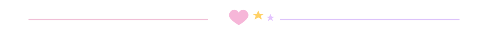
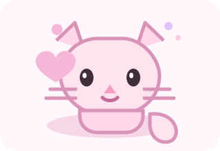

  

  
  
  
  

  

  finnish developer, crypto girl, and open source enjoyer building fun stuff on the internet.

  

  

## About Me

- currently competing in CTFs with `0xfun`
- `CryptoHack`: rank `#84` globally and `#1` in Finland
- main category is `crypto`, but I also play other categories too
- I like making open source projects, experiments, tools, and other fun stuff
- discord: `0x11a`

  

## Little Things I Like

- cryptography, pwning weird bugs, and solving challenge sets
- open source projects that are useful, silly, or both
- low-level systems, networking, and random technical rabbit holes

  

  
  

  

